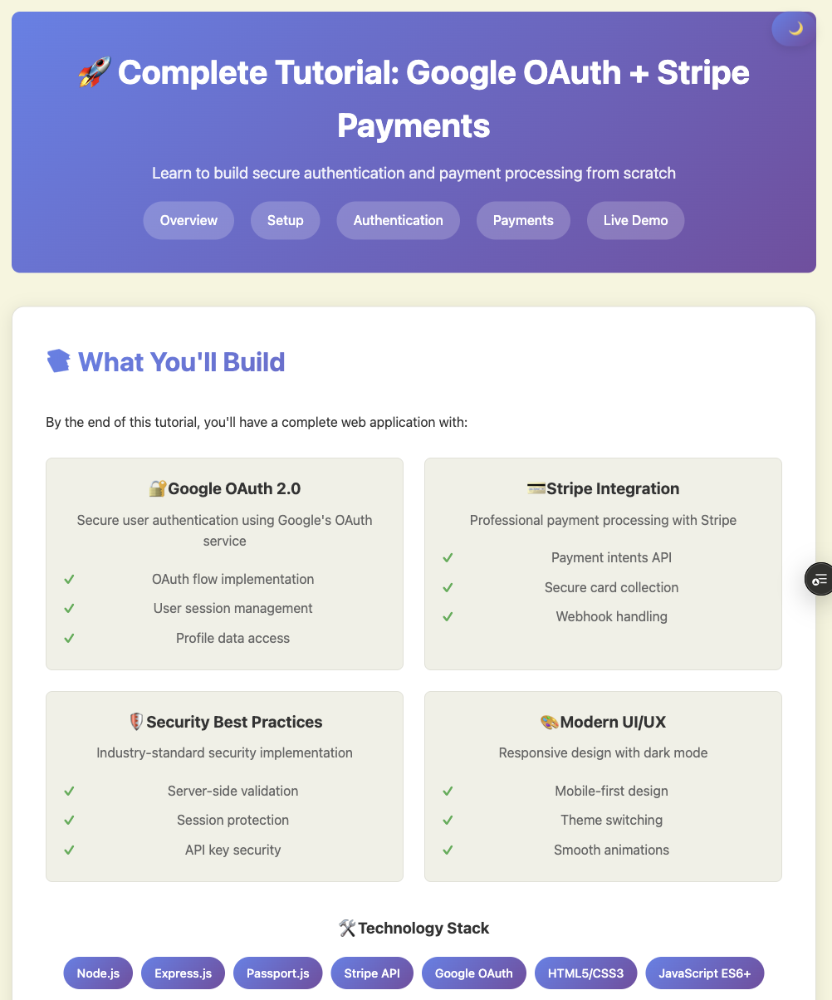

# Stripe Payment and Google Login Tutorial

This tutorial demonstrates how to integrate Stripe payments with Google OAuth authentication in a web application.

## 🌐 Live Demo
**[🚀 Visit Google Login/Stripe Payment tutorial](https://stripe-payment-and-google-login-tut.vercel.app/)**



## Features

- Google OAuth 2.0 authentication
- Stripe payment processing
- Secure payment handling
- User session management
- Responsive design

## Prerequisites

- Node.js (v16 or higher)
- A Stripe account and API keys
- A Google Cloud Console project with OAuth 2.0 credentials

## Setup

1. Clone this repository:
```bash
git clone https://github.com/raimonvibe/stripe-payment-and-google-login-tutorial.git
cd stripe-payment-and-google-login-tutorial
```

2. Install dependencies:
```bash
npm install
```

3. Create a `.env` file in the root directory:
```env
STRIPE_SECRET_KEY=your_stripe_secret_key_here
STRIPE_PUBLISHABLE_KEY=your_stripe_publishable_key_here
GOOGLE_CLIENT_ID=your_google_client_id_here
GOOGLE_CLIENT_SECRET=your_google_client_secret_here
SESSION_SECRET=your_session_secret_here
```

4. Start the development server:
```bash
npm start
```

5. Open your browser and navigate to `http://localhost:3000`

## Project Structure

```
├── public/
│   ├── index.html
│   ├── style.css
│   └── script.js
├── server/
│   ├── server.js
│   └── routes/
│       ├── auth.js
│       └── payment.js
├── package.json
├── .env.example
└── README.md
```

## How it Works

1. **Authentication**: Users sign in with their Google account using OAuth 2.0
2. **Payment Processing**: Authenticated users can make payments using Stripe
3. **Security**: All sensitive operations are handled server-side
4. **Session Management**: User sessions are maintained securely

## Environment Variables

- `STRIPE_SECRET_KEY`: Your Stripe secret key (starts with `sk_`)
- `STRIPE_PUBLISHABLE_KEY`: Your Stripe publishable key (starts with `pk_`)
- `GOOGLE_CLIENT_ID`: Your Google OAuth client ID
- `GOOGLE_CLIENT_SECRET`: Your Google OAuth client secret
- `SESSION_SECRET`: A random string for session encryption

## License

This project is licensed under the MIT License - see the LICENSE file for details.
